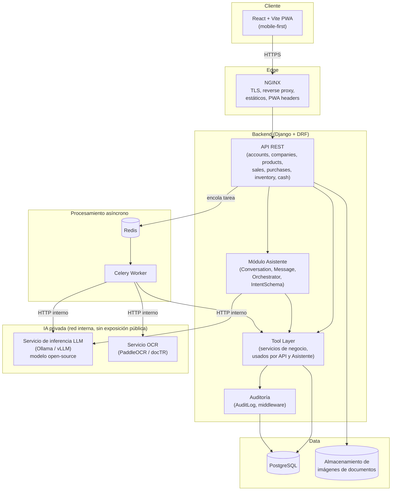
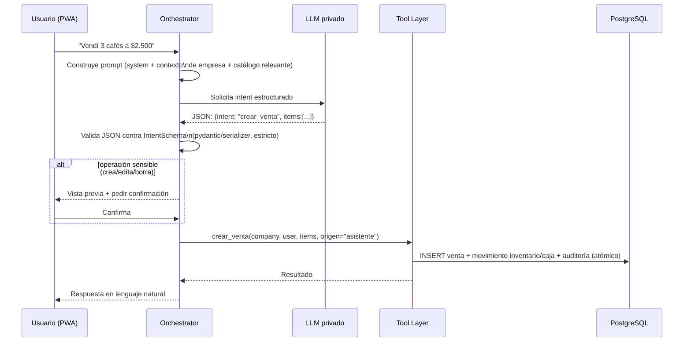

# MAGAVI — Arquitectura

## 1. Principios arquitectónicos

1. **El backend controla las escrituras, no el LLM.** El modelo interpreta
   intención; el backend valida, calcula y persiste. El LLM jamás tiene
   credenciales de base de datos ni ejecuta SQL.
2. **Una sola fuente de lógica de negocio.** Las reglas de "crear una venta"
   viven en una capa de servicios (Tool Layer) que usan por igual la UI
   tradicional, la API REST y el asistente. Nada de duplicar validaciones.
3. **Mobile-first, backend agnóstico de cliente.** El backend expone una API
   REST; el frontend (PWA) es un consumidor más.
4. **Aislamiento multiempresa por diseño**, no como capa añadida después.
5. **Monolito modular para el MVP**, no microservicios. Los componentes que
   sí necesitan aislarse por naturaleza (inferencia LLM, OCR) ya corren como
   procesos/contenedores separados, lo que deja la puerta abierta a
   escalarlos independientemente sin reescribir nada.
6. **Todo dato sensible fuera de los logs y fuera de proveedores externos**
   por defecto.
7. **Nada se ejecuta "solo" sobre datos importantes.** Documentos y acciones
   generadas por IA siempre pasan por confirmación humana antes de mutar
   datos financieros/inventario.

## 2. Vista de componentes



## 3. Componentes

### 3.1 Frontend — React + Vite + PWA

- SPA instalable, mobile-first, diseño de una sola columna con el chat como
  pantalla principal.
- Pantallas tradicionales (productos, ventas, compras, inventario,
  movimientos, configuración) como vistas secundarias accesibles desde un
  menú, reutilizando los mismos endpoints REST que usa el asistente.
- Cámara vía `<input capture>` / MediaDevices API para captura de
  documentos.
- Service Worker para instalabilidad y cache de shell (no cache de datos de
  negocio sensibles por defecto).

### 3.2 Backend API — Django + Django REST Framework

Apps Django propuestas (módulos independientes, bajo acoplamiento):

- `accounts` — usuarios, autenticación (JWT).
- `companies` — Company, CompanyUser, Module, CompanyModule.
- `catalog` — Product.
- `sales` — Sale, SaleItem.
- `purchases` — Purchase, PurchaseItem.
- `inventory` — InventoryMovement (cálculo de stock).
- `cashbox` — CashMovement.
- `documents` — Document, DocumentExtraction, integración con OCR.
- `assistant` — Conversation, Message, Orchestrator, IntentSchema.
- `audit` — AuditLog, middleware/decorators de auditoría.
- `core` / `tenancy` — utilidades transversales: middleware de empresa
  actual, managers con scope de empresa, permisos base.

### 3.3 Tool Layer (capa de herramientas)

Funciones de servicio puras (no vistas, no dependen de HTTP) que
implementan cada operación de negocio, p.ej.:

```
crear_venta(company, user, items: list[VentaItem], origen) -> Sale
registrar_compra(company, user, proveedor, items, origen) -> Purchase
consultar_ventas_periodo(company, desde, hasta) -> dict
consultar_stock_bajo(company, umbral) -> list[Product]
ajustar_inventario(company, user, product, cantidad, motivo, origen) -> InventoryMovement
```

Estas funciones:

- Reciben siempre `company` y `user` explícitos (nunca infieren desde un
  contexto global/thread-local implícito) para que el aislamiento sea
  verificable por inspección de firma.
- Son el único lugar que escribe en las tablas de negocio.
- Son invocadas tanto por los `ViewSets` de DRF (UI tradicional) como por el
  Orchestrator del asistente (tras validar el intent).
- Generan automáticamente `InventoryMovement`, `CashMovement` y `AuditLog`
  cuando corresponde (p.ej. `crear_venta` genera venta + movimiento de
  inventario + movimiento de caja + auditoría, en una sola transacción
  atómica).
- Son la unidad natural de test unitario (sin HTTP, sin mocks de request).

### 3.4 Módulo Asistente — arquitectura de conversación y tool-calling

Flujo de un mensaje del usuario:



Puntos clave de diseño:

- **Contrato de intención propio, no acoplado al "function calling" nativo
  de un modelo específico.** Se define un `IntentSchema` versionado (JSON
  Schema / pydantic) con las operaciones permitidas. Se le pide al LLM que
  responda **siempre** en ese formato (few-shot en el system prompt). Esto
  permite cambiar de modelo (Qwen, Llama, Mistral, o incluso una API externa
  en desarrollo) sin tocar el backend. Ver `DECISIONS.md` ADR-003.
- **El LLM nunca ejecuta nada.** Solo produce una propuesta de intención.
  El backend decide si es válida, si requiere confirmación, y es quien
  llama al Tool Layer con parámetros ya validados (tipos, rangos, que el
  producto exista y pertenezca a la empresa, etc.) — nunca con el JSON
  crudo del modelo.
- **Confirmación obligatoria server-side** para toda operación que
  cree/edite/borre datos (venta, compra, ajuste de inventario/caja). El
  estado de "pendiente de confirmación" vive en el backend (tabla o cache
  con expiración corta), no se confía en que el frontend "recuerde" lo que
  el usuario iba a confirmar.
- **Operaciones de solo lectura** ("¿cuánto vendí hoy?") no requieren
  confirmación, pero sí pasan igual por el Tool Layer (consultas con scope
  de empresa), nunca se generan respuestas inventando cifras.
- **Defensa contra prompt injection**: el contenido del usuario (incluido
  texto extraído por OCR) se trata siempre como dato, nunca como
  instrucción de sistema. El system prompt es fijo y no incorpora texto de
  usuario en la parte de instrucciones. El backend ignora cualquier
  pretensión del modelo de saltarse permisos, roles o confirmación —
  esas reglas se aplican en código, no se le "piden" al modelo. Ver
  `SECURITY.md`.
- Respuesta en lenguaje natural: para el MVP se puede generar con plantillas
  simples (más rápido, más barato, 100% predecible) y solo delegar al LLM
  la fase de "entender intención", no necesariamente la de "redactar
  respuesta". Se deja como opción configurable.

### 3.5 IA privada — servicio de inferencia

- Contenedor separado, **sin exposición pública**, solo accesible desde la
  red interna de Docker por el backend/worker.
- Interfaz HTTP compatible con OpenAI (Ollama y vLLM la ofrecen), para que
  el `LLMProvider` del backend sea un adaptador delgado y reemplazable.
- Ver alternativas de modelo/runtime evaluadas en `DECISIONS.md` ADR-004.

### 3.6 OCR y extracción de documentos

Pipeline (detalle también en `DATA_MODEL.md` para los estados de
`Document`):

```
Cámara → subir imagen (validada) → Document(status=uploaded)
  → tarea async (Celery) → OCR (texto crudo + layout)
  → LLM privado estructura el texto OCR a JSON (proveedor, fecha, items, total)
  → DocumentExtraction(structured_data, confidence)
  → Document(status=needs_review)
  → usuario revisa/edita en UI → confirma
  → Tool Layer crea Purchase/Sale real a partir de datos confirmados
  → Document(status=confirmed), AuditLog
```

Nunca se salta el paso de revisión humana, sin importar la confianza
reportada por el modelo.

### 3.7 Datos

- **PostgreSQL** como único almacén transaccional.
- **JSONB** se usa puntualmente para datos semi-estructurados que no son
  consultados relacionalmente (p.ej. `DocumentExtraction.structured_data`,
  `AuditLog.before/after`, `Message.structured_intent`) — nunca para datos
  de negocio "core" (montos, cantidades, FKs), que siempre son columnas
  tipadas.
- Almacenamiento de imágenes: volumen local Docker para el MVP, con
  interfaz que permite migrar a almacenamiento tipo S3 (MinIO) sin cambiar
  el resto del sistema.

### 3.8 Infraestructura y despliegue

- Docker + Docker Compose, Linux, NGINX como está propuesto — justificado
  en `DECISIONS.md`.
- Servicios de `docker-compose`: `nginx`, `backend`, `worker` (Celery),
  `redis`, `postgres`, `llm-inference`, `ocr-service`, y el build estático
  del frontend servido por `nginx` (o un contenedor `frontend` en dev).
- Variables de entorno vía `.env` (no versionado), plantilla en
  `.env.example`.
- `llm-inference` y `ocr-service` requieren más CPU/RAM (o GPU opcional);
  se documentan requisitos mínimos en Fase 8/9 cuando se implementen.

## 4. Multi-tenancy (resumen; detalle de datos en `DATA_MODEL.md`)

- **Estrategia elegida: base de datos compartida, esquema compartido,
  aislamiento por fila** (`company_id` en cada tabla de negocio), reforzado
  en varias capas:
  1. Middleware de request resuelve la empresa activa a partir del usuario
     autenticado + membresía (`CompanyUser`), la deja en `request.company`.
  2. Manager/QuerySet base (`CompanyScopedManager`) que **obliga** a filtrar
     por `company` — un query sin ese filtro debe fallar explícitamente en
     vez de devolver todo.
  3. El Tool Layer recibe `company` como parámetro explícito siempre (nunca
     variable global/thread-local), lo que hace el aislamiento auditable
     por lectura de código y testeable por firma de función.
  4. Suite de tests dedicada de aislamiento: por cada endpoint/listable,
     crear 2 empresas con datos y verificar que ninguna ve datos de la otra
     (Fase 2 en adelante, gate obligatorio).
  5. **Hardening futuro (no MVP, documentado como deuda técnica)**: Row
     Level Security nativo de PostgreSQL como segunda línea de defensa a
     nivel de base de datos, independiente de bugs de aplicación.
- Se descarta *schema-per-tenant* (django-tenants) para el MVP: más
  complejidad operacional (migraciones por schema, conexión dinámica) sin
  beneficio claro al volumen esperado (decenas/cientos de PyMEs). Se deja
  como opción de escalamiento si el aislamiento por fila resultara
  insuficiente. Ver ADR-002.

## 5. Qué NO hace esta arquitectura (explícitamente)

- No es microservicios ni tiene orquestación Kubernetes en el MVP.
- No permite que el LLM llame directamente a la base de datos ni ejecute
  código arbitrario.
- No hay multi-región ni alta disponibilidad activa-activa en el MVP.
- No se implementa *schema-per-tenant*.
- No se registra automáticamente nada proveniente de OCR/LLM sin
  confirmación humana.
