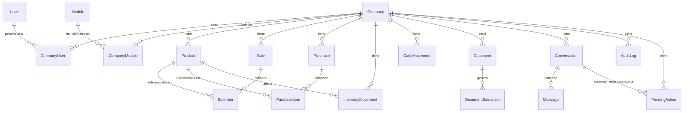

# MAGAVI — Modelo de Datos

## 1. Principios

- Toda tabla de negocio tiene `company` (FK a `Company`), **no nulo**,
  excepto las tablas globales/catálogo (`User`, `Company`, `Module`) y
  `AuditLog` (que admite `company` nulo solo para eventos de sistema sin
  contexto de empresa, p.ej. login fallido antes de elegir empresa).
- Montos y cantidades: `DecimalField` (nunca float) — precisión financiera.
- Toda tabla tiene `created_at`; las editables tienen además `updated_at`.
- Claves foráneas cruzadas deben pertenecer a la misma empresa (p.ej.
  `SaleItem.product.company == Sale.company`). Para el MVP esto se valida a
  nivel de aplicación (Tool Layer) con tests dedicados; una migración
  posterior puede añadir un *trigger* de PostgreSQL como refuerzo (deuda
  técnica documentada, no bloqueante).
- `JSONB` solo para datos semi-estructurados no consultados
  relacionalmente (extracción de documentos, snapshots de auditoría,
  intención cruda del asistente). Nunca para campos de negocio "core".
- No hay borrado físico de registros de negocio en el MVP (no se requiere
  soft-delete todavía; se documenta como decisión diferida, no como
  ausencia de diseño).

## 2. Entidades

### Identidad y multiempresa

**User**
`id, email (unique), password_hash, first_name, is_active, date_joined`
Un usuario puede pertenecer a más de una empresa vía `CompanyUser`. Para el
MVP la UI puede simplificar mostrando una sola empresa activa a la vez,
pero el modelo soporta N desde el día 1 (evita una migración dolorosa
después).

**Company**
`id, name, rut (unique), created_at, is_active`

**CompanyUser** *(no estaba explícito en el enunciado original; es
necesario — es la tabla que materializa "Usuario → Empresa" y sin ella no
hay multiempresa real, solo un FK 1-a-N)*
`id, company, user, role [owner|admin|staff], is_active, created_at`
`unique_together(company, user)`

**Module** (catálogo global, p.ej. "ventas", "compras", "inventario",
"caja", "documentos", "asistente")
`id, code (unique), name, description`

**CompanyModule** (qué módulos tiene habilitados cada empresa — en el MVP
todos habilitados por defecto, pero la tabla existe desde ya para no
migrar en caliente cuando exista un plan/paquete)
`id, company, module, enabled, enabled_at`

### Catálogo y transacciones

**Product**
`id, company, name, sku (nullable, unique_together con company), unit
[unidad|kg|lt|...], default_price, default_cost, is_active, created_at,
updated_at`

**Sale**
`id, company, created_by (User), sold_at, customer_name (texto libre,
opcional), total, status [confirmed|cancelled], source
[manual|assistant|document], created_at`

**SaleItem**
`id, sale, product, quantity, unit_price, subtotal`

**Purchase**
`id, company, created_by (User), purchased_at, supplier_name (texto libre
para MVP — ver nota abajo), total, status [confirmed|cancelled], source
[manual|assistant|document], created_at`

**PurchaseItem**
`id, purchase, product, quantity, unit_cost, subtotal`

> Nota: el modelo original no incluía `Supplier` como entidad. Para el MVP
> se usa `supplier_name` como texto libre (no todo micro-negocio tiene
> proveedores formalizados). Un modelo `Supplier` propio se difiere a una
> fase posterior si se detecta necesidad real (reportes por proveedor,
> etc.) — se documenta como deuda/backlog, no como omisión.

**InventoryMovement**
`id, company, product, type [in|out|adjustment], quantity, reference_type
[sale|purchase|manual], reference_id (nullable), balance_after, created_by,
created_at`
El stock actual de un producto se **deriva** de la suma de movimientos (o
se cachea en `Product.current_stock` con recálculo transaccional en cada
movimiento, para lecturas rápidas del dashboard). Se define en Fase 3 cuál
de las dos estrategias se implementa primero (recomendado: columna
cacheada + movimientos como registro auditable, ambas cosas).

**CashMovement**
`id, company, type [income|expense], amount, reference_type
[sale|purchase|manual], reference_id (nullable), description, created_by,
created_at`

### Documentos

**Document**
`id, company, uploaded_by, image (file ref), status
[uploaded|processing|needs_review|confirmed|rejected], document_type_guess
[purchase|sale|unknown], created_at, updated_at`

**DocumentExtraction**
`id, document (1-1 o 1-N si se permite reintentar), raw_ocr_text,
structured_data (JSONB: proveedor, fecha, items[], total), confidence,
reviewed_by (nullable), reviewed_at (nullable), created_at`

### Asistente

**Conversation**
`id, company, user, started_at, last_message_at`

**Message**
`id, conversation, role [user|assistant|system], content (texto),
structured_intent (JSONB, nullable — el intent propuesto por el LLM antes
de validar), created_at`

**PendingAction** *(entidad agregada en Fase 7; no estaba en el modelo
original — es la que materializa la máquina de estados de confirmación
exigida por `docs/ARCHITECTURE.md` #3.4 y `docs/SECURITY.md` #8, y sin
ella no hay dónde guardar "una propuesta de escritura del asistente
esperando confirmación humana")*
`id, company, user, conversation (nullable), intent_name, parameters
(JSONB — los parámetros crudos de la propuesta, no los ya validados: se
revalidan por completo al confirmar), status
[pending|confirmed|cancelled|expired], created_at, resolved_at
(nullable), expires_at`
Solo el usuario que propuso la acción puede confirmarla o cancelarla
(`user` + `company` + `id`). Una propuesta vencida (`expires_at` pasado)
se marca `expired` en el intento de confirmación, no de forma proactiva.

### Auditoría

**AuditLog**
`id, company (nullable), user (nullable, p.ej. acciones de sistema),
action (texto, p.ej. "sale.create"), entity_type, entity_id, before
(JSONB, nullable), after (JSONB, nullable), source
[ui|assistant|document|api|system], ip_address, created_at`
Tabla **append-only**: sin `UPDATE`/`DELETE` a nivel de aplicación (y
opcionalmente reforzado con permisos de rol de BD en fase de hardening).

## 3. Diagrama (resumen de relaciones)

## 4. Índices previstos (Fase 2+)

- `(company_id, created_at)` en `Sale`, `Purchase`, `InventoryMovement`,
  `CashMovement`, `AuditLog` — soporta las consultas típicas ("hoy",
  "esta semana").
- `(company_id, sku)` único en `Product`.
- `(company_id, is_active)` en `Product` para listados de catálogo activo.

## 5. Correcciones respecto al modelo propuesto originalmente

- Se agrega **`CompanyUser`** explícitamente (estaba implícito pero no
  listado) — es el corazón del multi-tenant.
- Se agrega **`CompanyModule`** con propósito claro (activación por
  empresa), aunque en el MVP todos los módulos estén habilitados por
  defecto — evita una migración de esquema cuando se introduzcan
  planes/paquetes.
- Se difiere **`Supplier`** como entidad propia; se usa texto libre en
  `Purchase.supplier_name` para el MVP.
- Se explicita que `InventoryMovement`/`CashMovement` llevan
  `reference_type/reference_id` genérico en vez de FKs separadas a Sale y
  Purchase, para no duplicar columnas nullable por cada posible origen.
- Se aclara que `AuditLog.company` es nullable solo para eventos sin
  contexto de empresa (login, errores de sistema), nunca para operaciones
  de negocio.
